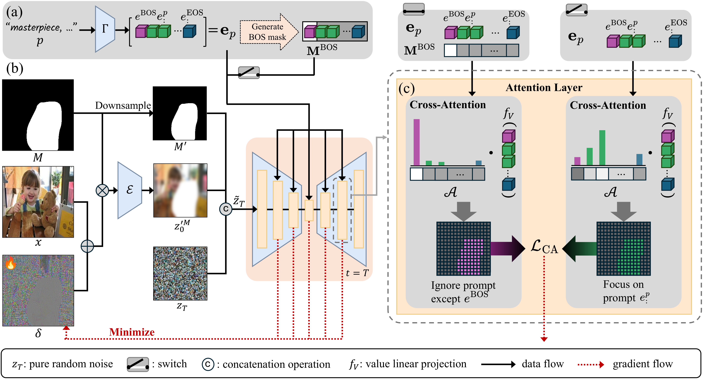

<div align="center">
<h2> PromptFlare: Prompt-Generalized Defense via Cross-Attention Decoy in Diffusion-Based Inpainting [MM 2025]</h2>
</div>

[arxiv](https://www.arxiv.org/abs/2508.16217)
[MM](https://dl.acm.org/doi/10.1145/3746027.3755763)



## Quick Installation
```
git clone https://github.com/NAHOHYUN-SKKU/PromptFlare.git
cd PromptFlare
conda create -n promptflare python=3.10
conda activate promptflare
pip install torch==2.4.1 torchvision==0.19.1 torchaudio==2.4.1 --index-url https://download.pytorch.org/whl/cu124
pip install -r requirements.txt
```

## Protect the Image by PromptFlare
Images must be in png format, and images with the same name must always exist in both the image folder and the mask folder.
```
python protect.py \
    --image [write_your_image_folder_path] \
    --mask [write_your_mask_folder_path] \
    --output [write_your_output_folder_path]
```
Or if you just want to try it on an uploaded Sample images:
```
python protect.py
```

## Inpaint the Protected Image
The annotation file is in csv format.   
The 'image_file_name' column contains the file name of each image, and the 'prompt' column contains the prompt for inpainting the image.   
A png image with the same name as the image file name must exist in all three folders: original, mask, and protected.
```
python inpaint.py \
    --annotation [write_your_annotation_file_path] \
    --original [write_your_original_image_folder_path] \
    --mask [write_your_mask_folder_path] \
    --protected [write_your_protected_image_folder_path] \
    --output [write_your_output_folder_path]
```
Or if you just want to try it on an uploaded Sample images:
```
python inpaint.py
```

## Results


## Citation
```
@inproceedings{na2025promptflare,
  title={PromptFlare: Prompt-Generalized Defense via Cross-Attention Decoy in Diffusion-Based Inpainting},
  author={Na, Hohyun and Hong, Seunghoo and Woo, Simon S},
  booktitle={Proceedings of the 33rd ACM International Conference on Multimedia},
  pages={10544--10553},
  year={2025}
}
```
